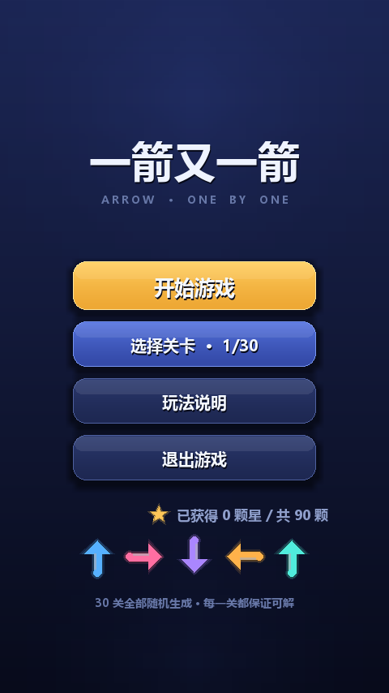
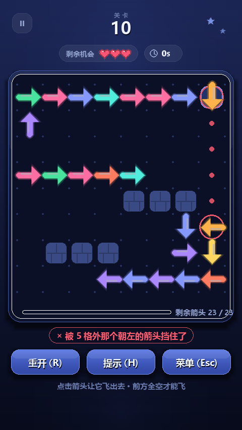
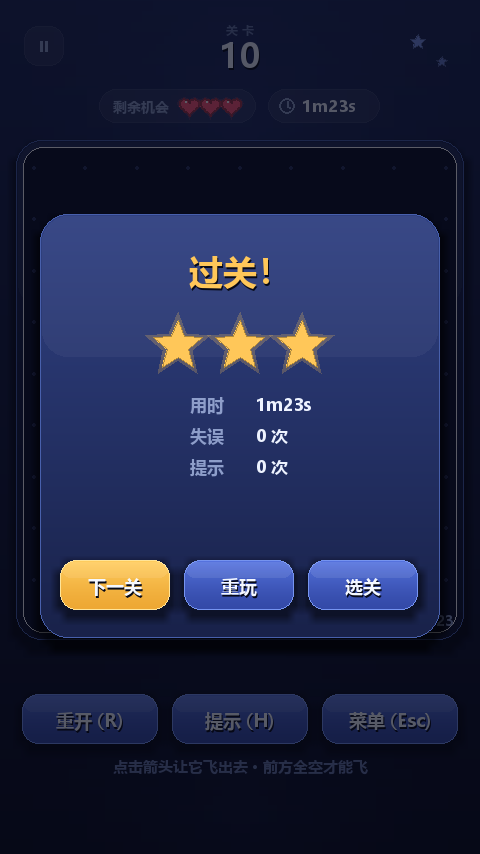
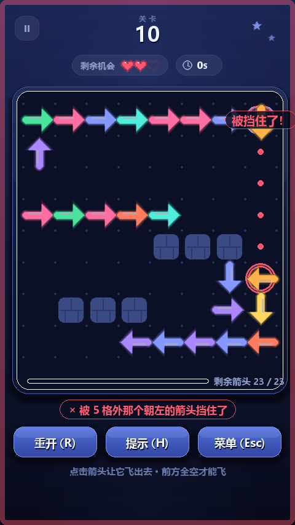
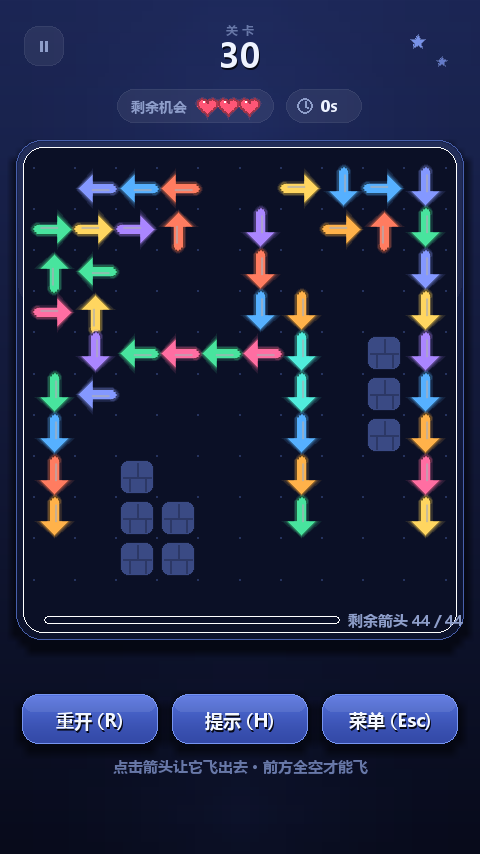

# 一箭又一箭（Arrow a Row）· Python + Pygame

> 课程作业：使用 Python 与 AIGC 工具独立开发一个「一箭又一箭」风格的小游戏。
> 棋盘上摆满指向四个方向的霓虹箭头，玩家按合适的顺序点击，让所有箭头依次飞出棋盘清空关卡。

## 一、游戏截图

| 开始界面 | 游戏界面（悬停预览弹道） | 通关结算 |
| --- | --- | --- |
|  |  |  |

| 关卡选择 | 碰撞反馈（抖动 + 闪红 + 扣一次机会） | 第 30 关（10×10、44 个箭头） |
| --- | --- | --- |
|  |  |  |

> 全部截图由 `python arrow_arrows/tools/screenshot.py` 无头渲染生成，存放在 `arrow_arrows/tools/shots/`。

## 二、游戏简介

* **玩法**：鼠标点击一个箭头，它会朝箭头所指的方向飞出棋盘；只有**正前方到棋盘边缘整条线都是空的**
  （没有别的箭头、也没有墙）时才飞得出去。点中被挡住的箭头会抖动闪红并**扣掉一次机会**，机会用完本关失败。
* **界面**：深色渐变底 + 霓虹箭头，顶部是关卡号、剩余机会（爱心）与计时，中间是带点阵网格的深色棋盘面板，
  面板底部是剩余箭头进度条，下面是「重开 / 提示 / 菜单」。悬停箭头会显示弹道预览：
  绿色表示能飞，红色虚线会把拦路的箭头圈出来。
* **关卡**：30 关，全部**程序化随机生成**并保证可解，难度随关卡（棋盘 4×4 → 10×10、箭头 5 → 44 个）递增。
* **零卡死**：点掉一个箭头只会让路径更空，绝不会让别的箭头更难飞，所以玩家永远不会把自己玩死。

## 三、开发环境

| 项目 | 版本 |
| --- | --- |
| 操作系统 | Windows 10 / 11（代码同时兼容 macOS、Linux） |
| Python | 3.12.8（3.10+ 均可） |
| Pygame | 2.6.1 |
| 中文字体 | 微软雅黑 `msyh.ttc` / `simhei.ttf`，代码里带多级回退 |
| 编辑器 | VS Code / PyCharm 均可 |

## 四、安装与运行

```bash
# 1. 安装依赖（只有一个）
pip install pygame

# 2. 运行游戏（在项目根目录下）
python arrow_arrows/main.py

# 也可以作为包运行
python -m arrow_arrows

# 3. 可选参数：直接进第 N 关 / 固定随机种子复现同一局
python arrow_arrows/main.py --level 10
python arrow_arrows/main.py --seed 2024 --level 15
```

运行所需资源：**没有任何图片、音频素材文件**——背景、箭头、爱心、星星、按钮全部是代码绘制的矢量图形，
音效是用标准库 `array` 合成的 PCM，所以只要装了 pygame 就能跑起来，不会出现「素材找不到」。

## 五、操作说明

| 操作 | 说明 |
| --- | --- |
| 鼠标左键点箭头 | 箭头飞出棋盘；被挡住则抖动、闪红、扣一次机会 |
| 鼠标悬停 | 显示弹道预览：**绿色**＝能飞，**红色虚线 + 红圈**＝被哪一枚箭头挡住 |
| `R` | 重新开始本关（布局不变，机会与计时复位） |
| `N` | 换一局（重新随机生成同一关） |
| `H` | 提示：高亮一个当前可以点的箭头 |
| `M` | 静音 / 恢复音效 |
| `Esc` | 暂停菜单（再按一次返回）；在结算界面返回主菜单 |
| 拖动窗口边缘 | 窗口自由缩放，画面等比拉伸，鼠标坐标自动换算 |

## 六、功能清单（对照作业要求）

| 作业要求 | 实现情况 |
| --- | --- |
| 可正常显示和操作的图形界面 | Pygame 窗口，开始 / 游戏 / 结算三类界面齐全，逻辑分辨率 480×854 可缩放，切界面有淡入 |
| 包含上下左右四种方向的箭头 | `core/model.py` 的 `Direction` 四方向；`parse_level()` 可用 `^ > v <` 直接描述棋盘 |
| 鼠标点击选择箭头 | 点击 → 屏幕坐标换算成格子 → `Board.arrow_at()` |
| 判断箭头前进方向是否存在其他箭头 | `Board.scan()` 位掩码 O(1) 扫描，同时区分「撞到箭头 / 撞到墙 / 一路畅通」 |
| 前方无阻挡时箭头飞出棋盘并消失 | 箭头带拖尾残影飞出棋盘 |
| 前方有阻挡时给出明显碰撞反馈 | 棋盘抖动 + 屏幕红框闪 + 弹道红点 + 拦路箭头红圈 + 飘字胶囊 + 提示音 |
| 设置并显示失误次数 | 三次机会，顶部胶囊显示「剩余机会 ♥♥♥」，另有「剩余箭头 x / y」进度条 |
| 至少 3 个可通关关卡 | 30 关（`TOTAL_LEVELS = 30`），逐关自动试玩验证全部可通 |
| 清空全部箭头后显示通关并进入下一关 | 结算卡片显示星级 / 用时 / 失误 / 最好成绩，按钮「下一关 / 重玩 / 选关」 |
| 失误次数耗尽显示失败 | 失败卡片「机会用完了」，按钮「再来一次 / 换一局 / 返回主菜单」 |
| 重新开始恢复当前关卡初始状态 | `R` 或「重开」按钮：布局、机会、计时、失误全部复位（有测试保证） |
| 扩展功能 | 关卡选择、星级评价、计时、提示、进度存档、随机可解关卡、AI 自动求解、音效、动画、界面淡入 |

## 七、目录结构

```
arrow_arrows/
├── main.py                  入口（python arrow_arrows/main.py，支持 --level / --seed）
├── __main__.py              入口（python -m arrow_arrows）
├── core/                    纯逻辑层：不 import pygame，可脱离界面单测
│   ├── model.py             Board / Arrow / Direction：位掩码 O(1) 弹道扫描、点击判定
│   ├── generator.py         关卡生成：逆向走廊构造法（保证可解）+ 难度曲线
│   └── solver.py            贪心求解器：可解性自检、H 键提示来源
├── ui/                      界面层
│   ├── app.py               窗口、主循环、状态机、输入、界面淡入
│   ├── board_view.py        棋盘坐标换算、绘制、动画（飞出 / 抖动 / 飘字 / 提示）
│   ├── scenes.py            主菜单、选关、玩法说明、游戏 HUD、暂停 / 过关 / 失败弹层
│   ├── widgets.py           按钮与关卡格子（预渲染渐变底 + 阴影）
│   ├── shapes.py            渐变 / 柔光 / 投影、霓虹箭头、爱心星星等图标、文字排版
│   ├── theme.py             配色、字体、布局常量
│   ├── audio.py             代码合成音效（不依赖素材文件）
│   └── storage.py           进度存档 progress.json
├── tests/
│   ├── test_core.py             规则与生成器 21 个用例
│   ├── test_ui_smoke.py         界面集成 11 个用例（含自动通关拿三星）
│   └── test_assignment_cases.py 作业测试表 T01–T06
└── tools/
    ├── screenshot.py        无头渲染各界面为 PNG
    ├── verify_levels.py     逐关自动试玩并输出通关报告
    └── shots/               渲染出来的界面截图
```

## 八、实现思路摘要

### 1. 箭头与方向的表示

```python
class Direction(Enum):                 # 方向：value 就是 (dx, dy)，屏幕坐标 y 向下
    UP = (0, -1); RIGHT = (1, 0); DOWN = (0, 1); LEFT = (-1, 0)

@dataclass
class Arrow:
    id: int
    x: int; y: int                     # 所在格子，(0,0) 在左上角
    direction: Direction
    color: int                         # 调色板下标，界面层解释成霓虹色
```

* 一个箭头占一格、带一个方向，规则因此非常干净：**能不能飞 = 它正前方那条射线是否畅通**。
* 棋盘为每一行、每一列各维护「箭头 / 墙」两个位掩码，一次位运算就能拿到最近的障碍物（O(1)）：

```python
am = self._arrow_row[y] >> (x + 1)      # 前方所有箭头压缩成一个整数
wm = self._wall_row[y]  >> (x + 1)
da = (am & -am).bit_length() - 1        # 最近箭头的距离（取最低位）
dw = (wm & -wm).bit_length() - 1        # 最近墙的距离
# 两个掩码都是 0 → 一路畅通，可以飞出去
```

### 2. 关卡怎么保证一定能通

正确顺序记作 `r1…rn`（`r1` 最先点）。点到 `ri` 时场上还剩 `ri…rn`，所以 `ri` 正前方的射线上
不能有**更晚被点掉**的箭头；已经被点掉的更早箭头在它射线上无所谓。因此只要保证
**「每放一个新箭头时，它正前方的射线没有已放的箭头、也没有墙」**，那么「按放置顺序倒着点」必定是合法解。

在这个约束下，生成器**一条走廊一条走廊地铺**：沿某个方向放一个箭头，接着在它正前方那一格
起下一个箭头（65% 概率拐 90°），直到铺不动。同一条走廊上每个箭头都被紧挨着的下一个挡住，
只有走廊末端那一个能直接飞出去，所以**开局可点的箭头数 ≈ 走廊条数**，走廊越长越难。

### 3. 玩家为什么不会把自己玩死

点掉一个箭头只会让格子变空，**不可能让别的箭头变得更难飞**——可点箭头集合是单调递增的。
所以只要一直点能飞的箭头，一定能把棋盘清空；难度来自「在几十个箭头里找出能点的那几个」
和失误惩罚，而不是「可能把自己玩死」。`solver.greedy_solve()` 正是基于这条性质做的，
它同时用于生成后自检、H 键提示和自动化测试。

### 4. 关卡生成质量（每关 5 次生成取平均）

| 关卡 | 1 | 5 | 10 | 15 | 20 | 30 |
| --- | --- | --- | --- | --- | --- | --- |
| 棋盘 | 4×4 | 6×6 | 8×8 | 10×10 | 10×10 | 10×10 |
| 箭头数 | 5 | 13 | 23 | 32 | 42 | 44 |
| 开局可点 | 2.2 | 3.0 | 3.0 | 3.8 | 3.8 | 3.4 |
| 占格率 | 31% | 42% | 36% | 38% | 44% | 44% |
| 单次生成耗时 | 0.5 ms | 1.1 ms | 1.6 ms | 2.9 ms | 10 ms | 7.6 ms |

## 九、测试

```bash
# 全部测试：38 个用例（规则 21 + 界面 11 + 作业测试表 6），约 1 秒
python -m unittest discover -s arrow_arrows/tests -t .

# 逐关自动试玩（用和玩家完全一样的点击链路把 30 关打一遍，输出通关报告）
python arrow_arrows/tools/verify_levels.py

# 无头渲染界面截图
python arrow_arrows/tools/screenshot.py
```

作业测试表 T01–T06 对应 `arrow_arrows/tests/test_assignment_cases.py`，运行时会打印每条的「实际结果」：

| 编号 | 测试内容 | 预期结果 | 自动化用例 |
| --- | --- | --- | --- |
| T01 | 点击前方无阻挡的箭头 | 箭头飞出棋盘并消失 | `test_t01_click_free_arrow` |
| T02 | 点击前方有阻挡的箭头 | 箭头不消失，失误次数减 1 | `test_t02_click_blocked_arrow` |
| T03 | 点击位于边缘且朝向棋盘外的箭头 | 箭头正常消失，不发生越界错误 | `test_t03_edge_arrow_pointing_outside` |
| T04 | 消除本关全部箭头 | 显示通关并进入下一关 | `test_t04_clear_level_and_go_next` |
| T05 | 失误次数耗尽 | 显示失败并允许重新开始 | `test_t05_lives_run_out_then_restart` |
| T06 | 游戏进行中重新开始 | 箭头布局和失误次数恢复 | `test_t06_restart_in_the_middle` |

## 十、AIGC 使用与素材来源

* 开发过程使用了 AIGC 编程助手（DeepSeek）协助：需求拆解、代码结构设计、界面绘制与动画、测试用例模板；
  算法正确性验证、参数调优与全部 Bug 定位修复由本人完成，详细记录见 `博客.md` 与 `实验报告.md`。
* **不使用**原商业游戏的任何代码、美术素材、音效或关卡数据；棋盘全部由本项目的生成算法产出。
* 项目内所有图形均由 Pygame 绘制指令生成，音效由代码合成，**没有引用任何第三方图片 / 音频素材**，
  因此无需标注外部素材来源。
* 仓库内不含任何账号、Cookie、API Key、Token 等敏感信息（`.gitignore` 已排除本地存档与缓存）。
