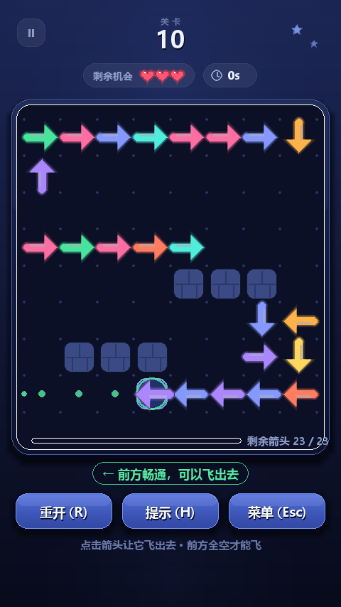

# 用 Python + AIGC 做一个《一箭又一箭》小游戏

| 项目 | 内容 |
| --- | --- |
| 这个作业属于哪个课程 | <课程链接，请替换> |
| 这个作业要求在哪里 | <作业链接，请替换> |
| 这个作业的目标 | 使用 Python 和 AIGC 完成「一箭又一箭」小游戏 |
| 学号 | <你的学号> |
| GitHub 仓库 | <你的仓库链接> |

> 说明：本文中的截图均由程序无头渲染生成（`python arrow_arrows/tools/screenshot.py`），
> 代码、测试与生成数据都来自本地真实运行结果。

---

## 一、项目展示

| 开始界面 | 选关界面 | 玩法说明 |
| --- | --- | --- |
|  |  |  |

| 游戏进行中（悬停可飞的箭头：绿色弹道预览） | 被挡住（红色弹道 + 红圈标出拦路箭头） |
| --- | --- |
|  |  |

| 碰撞反馈（抖动 + 红框 + 飘字 + 扣一次机会） | 通关结算（星级 / 用时 / 失误） | 第 30 关：10×10、44 个箭头 |
| --- | --- | --- |
|  |  |  |

> 想让展示更直观，可以按下面的命令自己录一段 GIF（Windows 下用 Win+G，或 ScreenToGif）：
> `python arrow_arrows/main.py --level 10`，随手演示「点能飞的箭头 → 箭头整条飞出去 → 点错扣机会 → 通关弹层」。

---

## 二、项目介绍

### 游戏规则

1. 棋盘上摆满指向上下左右四个方向的霓虹箭头。
2. 鼠标点击箭头，它就会朝箭头所指方向飞出去——**前提是它正前方到棋盘边缘整条线都是空的**。
3. 前方有别的箭头（或墙）挡着时，箭头飞不出去：棋盘会抖动、闪红、把拦路的箭头圈出来，并**扣掉一次机会**。
4. 清空棋盘上全部箭头即通关；三次机会用完则本关失败，可以「再来一次」。
5. 共 30 关，棋盘从 4×4 到 10×10，箭头从 5 个到 44 个，全部随机生成且**保证可解**。

### 界面设计

竖屏手机比例（逻辑分辨率 480×854，可自由缩放）。视觉上走「深空靛蓝 + 霓虹」的干净路线：

* 背景是几乎无花纹的深色渐变，只在上下各加一处柔光（第一版铺满斜条纹，太吵，已删掉）；
* 棋盘是一块带柔和投影、渐变填充和 1px 亮边的圆角面板，里面是点阵网格；
  箭头不再铺格子底块，只有鼠标悬停的那一枚才高亮，棋盘因此清爽很多；
* 顶部左侧是暂停按钮，中间是小字标签「关卡」+ 大号关卡号，下面一排两枚半透明胶囊
  （「剩余机会 ♥♥♥」与「计时」）；
* 「剩余箭头 x / y」进度条收进棋盘面板底部，不额外占高度；
* 底部是三个圆角按钮（重开 / 提示 / 菜单）和一行浅色提示文字；切换界面时有淡入过渡。

### 主要功能与特色

| 功能 | 说明 |
| --- | --- |
| 四方向霓虹箭头 | 圆头短杆 + 三角头 + 柔光 + 深色描边，飞出时带三层拖尾残影 |
| 路径检测可视化 | 悬停即显示弹道：绿色＝能飞，红色虚线＋红圈＝被谁挡住 |
| 碰撞反馈 | 棋盘抖动 + 屏幕红框闪 + 弹道红点 + 拦路箭头红圈 + 飘字胶囊 + 提示音 |
| 失误机制 | 三次机会，胶囊里用爱心显示；面板底部显示「剩余箭头 x / y」 |
| 通关 / 失败结算 | 星级评价（零失误零提示＝三星）、用时、失误次数，可下一关 / 重玩 / 选关 |
| 重新开始 | `R` 或「重开」：布局、机会、计时、失误全部复位 |
| 扩展功能 | 选关、进度存档、提示、换一局、计时、音效、**随机可解关卡生成**、自动求解 |

---

## 三、实现思路

### 1. 箭头、方向与关卡怎么表示

```python
class Direction(Enum):          # 方向：value 就是 (dx, dy)，屏幕坐标 y 向下
    UP = (0, -1); RIGHT = (1, 0); DOWN = (0, 1); LEFT = (-1, 0)

@dataclass
class Arrow:
    id: int
    x: int; y: int              # 所在格子，(0,0) 在左上角
    direction: Direction
    color: int
```

* **箭头**就是「一格 + 一个方向」。这个表示法看着朴素，但它让规则变得极干净：
  **「能不能飞」只需判断它正前方那条射线是否畅通**，不用做矩形碰撞、不用算包围盒，
  生成算法和提示算法也都建立在同一条判断上。
  （开发中试过「一枚箭头占 1~4 格连成长条」的方案，实现完并修掉一个会让关卡不可解的 Bug 之后，
  实际试玩发现棋盘又挤又乱、模型和渲染都要多写一层，最后判断**不值得**，回退成了单格箭头。）
* **关卡**不写死，全部由生成算法产出（见第 3 点）；`Board` 负责尺寸、墙、箭头以及全部规则判定，
  界面层只调用它，不自己判断规则——所以规则层可以脱离 Pygame 单独跑单元测试。
* **点击**的判定结果是 `ClickResult`（能不能飞 / 撞到什么 / 弹道路径 / 拦路的箭头），
  界面层据此播放不同动画，规则层完全不关心动画。

### 2. 路径检测（重点）

最核心的问题：**从箭头出发，沿它的方向看过去，第一个撞到的是什么？**

朴素写法是逐格循环。我用「位掩码」把它变成 O(1)：棋盘为每一行维护「箭头占用」和「墙占用」
两个整数（第 i 位表示第 i 格被占），列也各维护一份。于是：

```python
def scan(self, x, y, direction):
    if direction is Direction.RIGHT:
        am = self._arrow_row[y] >> (x + 1)        # 前方所有箭头压成一个整数
        wm = self._wall_row[y]  >> (x + 1)        # 前方所有墙
        da = (am & -am).bit_length() - 1          # 最近箭头的距离（取最低位 1）
        dw = (wm & -wm).bit_length() - 1          # 最近墙的距离
        if da is not None and (dw is None or da <= dw):
            return Hit("arrow", (x + 1 + da, y), da + 1)
        if dw is not None:
            return Hit("wall", (x + 1 + dw, y), dw + 1)
        return Hit("edge", None, self.width - x)  # 一路畅通 → 可以飞出去
```

向左 / 向上时用「取最高位 1」得到最近的格子，四个方向各写一小段，避免在热路径里做字符串或循环。
这个方法被悬停预览、点击判定、关卡生成、提示算法共用，一次调用约 0.5 µs。

**边界情况**：箭头贴边且朝棋盘外时，射线长度为 0，必须直接判为可飞，不能越界访问数组
（对应测试 T03：四个贴边朝外的箭头都要正常飞出）。

### 3. 关卡怎么做到「随机生成还保证能通」

这是我的做法，也是整个项目最费心思的地方。

设正确点击顺序是 `r1, r2, …, rn`（`r1` 最先点掉）。点到 `ri` 时场上还剩 `ri…rn`，
所以 `ri` 正前方的射线上不能有**比它更晚被点掉**的箭头；而已经被点掉的更早箭头在它射线上无所谓。
于是只要构造时保证：**每放一个新箭头，它正前方的射线上没有已放好的箭头、也没有墙**，
那么「按放置顺序倒着点」就一定是一组合法解。

在这个前提下，为了**好玩**（不能一放就是一堆随时能点的箭头），我让生成器一条条铺「走廊」：

```
随机找一条最长的可用射线当起点
  → 沿该方向放一个箭头
  → 紧接着在它正前方那一格起下一个箭头，65% 概率拐 90°
  → 重复，直到铺不动
```

同一条走廊上，每个箭头都被紧挨着的下一个挡住，只有走廊末端那一个能直接飞出去，
所以**开局能点的箭头数 ≈ 走廊条数**；走廊越长、棋盘越大，谜题越难。
生成结束后还会用贪心求解器验一遍，不通过就丢弃重来。

另外还有一条让玩家体验变好的性质：**点掉一个箭头只会让路径更空，永远不会让别的箭头更难飞**。
所以玩家不可能把自己玩死——难度来自「在几十个箭头里找出能点的那几个」，而不是「可能走进死局」。

### 4. 界面与动画

`ui/app.py` 是一个小状态机（菜单 / 选关 / 说明 / 游戏 + 暂停、过关、失败三种弹层），
每个场景的绘制函数会**返回本帧的按钮列表**，主程序直接用它做命中判定，
所以「按钮画在哪里」和「能点哪里」永远是同一份数据。飞出动画按 `p^1.6` 加速平移，
再叠 3 个渐淡残影做拖尾；面板、按钮的阴影与柔光用「小图画好再放大」的方式做出模糊，
一次算好缓存起来；音效用标准库 `array` 合成 PCM。整个项目**没有任何图片 / 音频素材文件**。

界面本身也迭代了两轮：第一版是斜条纹背景 + 每格一个底块 + 元素堆叠，实际跑起来很杂乱；
第二版把背景换成无花纹的深色渐变加柔光、去掉格子底块（只保留悬停高亮）、
把信息收进胶囊、进度条内嵌进棋盘面板，并给界面切换加了淡入，才达到现在的观感。

---

## 四、AIGC 使用过程

我使用的 AIGC 工具：**DeepSeek**（对话式编程助手）。协作方式是我负责拆需求、定架构、定规则、
验证算法和跑测试，AI 负责生成样板代码与第一版实现，我再逐处审查、修改、补测。

### 4.1 过程一览

| 子任务 | 借助何种 AIGC 技术 | AI 实现或提供了什么 | 效果如何 | 人工修改 |
| --- | --- | --- | --- | --- |
| 需求拆解与结构设计 | DeepSeek | 把「点击顺序 / 路径检测 / 碰撞反馈 / 关卡状态管理」拆成 core+ui 两层与模块清单 | 结构合理，直接沿用 | 自己补上「规则层不许 import pygame」的约束，保证可单测 |
| 路径检测 | DeepSeek | 生成四个方向的射线判定代码 | 逐格循环版本可跑，但性能与边界都一般 | 改成**行/列位掩码** O(1) 扫描；补「贴边朝外不越界」的测试 |
| 关卡生成（第一版） | DeepSeek | 「随机撒点 + 打分」的生成器 | 能生成，但第 30 关开局有 **23 个可点箭头（42%）**，谜题没难度 | 诊断出打分把「已被挡住的箭头」算成收益，改成只统计当前可飞的箭头 |
| 关卡生成（走廊版） | DeepSeek | 走廊式生成的第一版 | 第 30 关只有 22.6 个箭头、走廊全挤在边上 | 起点改为「按最长可用射线排序后随机取前五」，第 30 关回到 44 个箭头 / 占格 44% |
| 多格长箭头（试做后回退） | DeepSeek | 把箭头改成占 1~4 格的长条，并给出落点判据与画法 | 判据漏判射线尽头，**第 18 关生成成不可通关的死局**；修好后试玩发现棋盘又挤又乱 | 修完 Bug 后判断收益不大，**回退成单格箭头**，保留「走廊式生成」 |
| 界面视觉 | DeepSeek | 第一版界面（斜条纹背景 + 每格底块 + 堆叠元素） | 能看，但杂乱、层次不清 | 自己重做一版：深色渐变 + 柔光、霓虹箭头、胶囊信息条、进度条内嵌面板、界面淡入 |
| 碰撞反馈动画 | DeepSeek | 补全箭头抖动、飘字代码 | 基本可用 | 调整抖动幅度/时长，加屏幕红框闪、拦路箭头红圈、飘字胶囊 |
| 测试用例 | DeepSeek | 生成路径检测与求解器的测试模板 | 覆盖不足 | 自己补「一定可解」「单调性」「自动通关拿三星」「T01–T06」 |
| 中文字体细节 | DeepSeek | 提示文案里用了 `✕` | 微软雅黑没有该字形，渲染成方块 | 换成 `×`，方向符号按箭头方向动态取 `↑↓←→` |
| 测试崩溃排查 | 本人定位 | —— | 加完 T01–T06 后 `unittest discover` 退出码变成 0xC0000005 | 用「单跑 / 两两组合」二分定位到多个模块重复 `pygame.quit()`，去掉测试里的 quit |

### 4.2 三个代表性的协作过程（详细）

**① 路径检测：AI 给的循环版本 → 我改成位掩码**

我提的要求是「给我四个方向的射线检测，返回第一个撞到的东西」。AI 给的是逐格 while 循环版本，
能跑，但悬停预览每帧都要调用，箭头一多就有明显掉帧，而且贴边朝外的箭头容易越界。
我改成给每一行、每一列各维护「箭头 / 墙」两个位掩码，一次移位加取最低位就能得到最近障碍物
（见第三部分代码）。改完不仅快了一个量级，代码也更短，还顺手把「贴边朝外」变成了天然正确的分支。

**② 关卡生成：AI 的打分标准是错的，导致谜题没有难度**

我要求「生成保证可解、而且有难度的关卡」。AI 的生成器能跑，但我写了个诊断脚本统计每关开局
能点的箭头数，发现第 30 关有 **23 / 55 个箭头随时能点**（42%），基本是白给。把某一步摊开打印：

```
准备放置: (4, 2) Direction.DOWN score = 1
  arrow Arrow#2(5,2,LEFT) dist_to_cell=1 hit=arrow at (1,2) distance=4 free=False
```

`Arrow#2` 已经被 `(1,2)` 的箭头挡住了，再在它前面放一个箭头对它毫无影响，
但判据 `hit.distance > dist` 依然给了 1 分——**生成器以为自己每步都在制造依赖，其实在放水**。
我把它改成只统计「当前还能飞」的箭头（`scan(...).kind == "edge"`），自由箭头立刻降到 3 个左右。

**③ 多格长箭头：AI 的合法性判据漏了一种情况，关卡直接变成死局**

（这一段是「试做后又回退」的方案，但 Bug 本身很典型，值得记下来。）

我想让箭头看起来像参考图那样是一条彩色长廊，于是把「一枚箭头 = 一格」改成「一枚箭头 = 一串共线格子」。
AI 给的落点判据是「从落点开始数连续空几格」，身体长度不超过这个数就行。结果第 18 关生成出来
**贪心求解器判定不可解**。我写了个「谁挡着谁」的有向图并做环检测，抓到问题：

```
arrow#19 (1,7)->(1,7) RIGHT len=1  头前方: arrow (4,7) -> #16
环: [[16, 19, 18, 17, 16]]        ← 四枚箭头互相挡住，这一关永远打不通
```

原因是身体只占前面几格，射线**尽头**还有旧箭头时被漏判了。正确的判据是
「从落点一路空到棋盘边缘」：`scan(cell, dir).kind == "edge"`。改完再跑环检测是「无环」，
30 关自动试玩全部通关。

> 这次让我印象最深：**这个 Bug 不会让程序崩溃，只会让关卡变得不可能通关**。
> 从那以后我把「求解器自检」直接写进了生成流程——生成完先让求解器试着清空，解不掉就重生成。

改好之后我又实际试玩了几关，发现多格箭头虽然「像参考图」，但棋盘明显更挤更乱、
一眼分不清哪一枚能点，模型和生成器还要为「身体」多写一层逻辑。权衡之后我**回退了单格方案**，
只保留真正让谜题好玩的「走廊式生成」，并把界面重新做了一版。这算是我在这次作业里做的最像
「工程判断」的一个决定：**AI 能把方案实现出来，但值不值得留下得自己判断。**

---

## 五、测试结果

### 5.1 作业测试表 T01–T06

自动化用例位于 `arrow_arrows/tests/test_assignment_cases.py`，运行
`python -m unittest arrow_arrows.tests.test_assignment_cases -v` 会打印每条的「实际结果」。

| 编号 | 测试内容 | 预期结果 | 实际结果 | 是否通过 |
| --- | --- | --- | --- | --- |
| T01 | 点击前方无阻挡的箭头 | 箭头飞出棋盘并消失 | 箭头数 13 → 12，该格已空，飞出动画 1 个 | 通过 |
| T02 | 点击前方有阻挡的箭头 | 箭头不消失，失误次数减 1 | 箭头数仍为 15，剩余机会 2/3，抖动 0.36 s，飘字 1 条 | 通过 |
| T03 | 点击位于边缘且朝向棋盘外的箭头 | 箭头正常消失，不发生越界错误 | 4 个贴边朝外箭头全部飞出，棋盘清空，弹层 win | 通过 |
| T04 | 消除本关全部箭头 | 显示通关并进入下一关 | 11 步清空、失误 0、星级 3；点「下一关」进入第 5 关 | 通过 |
| T05 | 失误次数耗尽 | 显示失败并允许重新开始 | 3 次失误后弹层 lose；「再来一次」后机会恢复 3/3 | 通过 |
| T06 | 游戏进行中重新开始 | 箭头布局和失误次数恢复 | 飞 1 个 + 撞 1 次后布局回到初始状态，机会 3/3、失误归零 | 通过 |

### 5.2 其他测试

```bash
# 38 个自动化用例：规则 21 + 界面集成 11 + 作业测试表 6，约 1.2 秒
python -m unittest discover -s arrow_arrows/tests -t .

# 30 关逐关自动试玩（用和玩家一样的点击链路）
python arrow_arrows/tools/verify_levels.py
```

试玩验证结果：**30 关全部正常通关、零失误**，每关步数恰好等于箭头数，说明每一关都存在合理通关顺序。

| 关卡 | 1 | 5 | 10 | 15 | 20 | 25 | 30 |
| --- | --- | --- | --- | --- | --- | --- | --- |
| 棋盘 | 4×4 | 6×6 | 8×8 | 10×10 | 10×10 | 10×10 | 10×10 |
| 箭头数 | 5 | 13 | 23 | 32 | 42 | 44 | 44 |
| 结果 | 通关 | 通关 | 通关 | 通关 | 通关 | 通关 | 通关 |

### 5.3 关卡生成质量（每关 5 次生成取平均）

| 关卡 | 4 | 8 | 10 | 18 | 30 |
| --- | --- | --- | --- | --- | --- |
| 实际箭头数 | 11.0 | 19.0 | 23.0 | 38.0 | 44.0 |
| 开局可点箭头 | 2.8 | 2.8 | 3.0 | 2.6 | 3.4 |
| 占格率 | 44.0% | 38.8% | 35.9% | 38.0% | 44.0% |
| 单次生成耗时 | 0.5 ms | 1.8 ms | 1.6 ms | 2.9 ms | 7.6 ms |

---

## 六、PSP 表格

> 下表按本次实际开发过程记录（单位：小时）。

| 任务 | 预估耗时 | 实际耗时 | 差异 |
| --- | --- | --- | --- |
| 需求分析与游戏设计 | 1.5 | 1.5 | 0 |
| Python 与图形库学习 | 1.0 | 0.5 | −0.5 |
| 游戏界面实现（含一次视觉重做） | 4.0 | 5.0 | +1.0 |
| 路径与碰撞逻辑实现 | 2.0 | 2.5 | +0.5 |
| 关卡设计（生成算法调参） | 3.0 | 5.5 | +2.5 |
| AIGC 辅助开发 | 2.0 | 2.5 | +0.5 |
| 测试与修改 | 2.5 | 3.5 | +1.0 |
| README 与博客撰写 | 2.0 | 1.5 | −0.5 |
| **合计** | **18.0** | **22.5** | **+4.5** |

差异最大的两块：一是**关卡生成算法**，原以为「保证可解」写出来就完事，实际在「可解 + 有难度 +
密度合适」之间反复调参，还踩到一次生成死局的严重 Bug；二是**界面**，第一版做完自己都觉得杂乱，
又整体重做了一遍视觉（配色、层次、间距、留白），比预估多花了约一小时。

---

## 七、心得体会

**AI 帮了我什么。** 作为一个没写过游戏的人，AI 最大的价值是把我从「样板代码」里解放出来：
窗口循环、按钮控件、渐变背景、存档读写、测试模板，这些它一次就写得八九不离十，
我只需要在上面改。它还帮我快速看清了一个陌生库（Pygame）的常用写法，学习成本明显下降。

**AI 出的问题。** 这次一共修掉六个真实缺陷，其中四个是**逻辑漏洞**：打分函数把已挡住的箭头算成收益、
多格长箭头的合法判据漏判射线尽头（直接导致关卡不可通关）、走廊起不来就终止整张棋盘、
多个测试模块重复 `pygame.quit()` 导致进程崩溃；另外两个是表现层问题（提示被按钮压住、`✕` 字形缺失）。
它们有个共同点——**程序都能正常跑起来，不会报错**，只是游戏变得没难度、不可通关或者不好看。
如果我只看「能跑就行」，这些坑一个都发现不了。

**我的收获。**
第一，**验证比生成重要**。我这次最有用的一件事是写诊断脚本：打印每关的可点箭头占比、占格率、
生成耗时，甚至写了个环检测脚本去查「谁挡着谁」。这些量化指标才是 AI 代码的照妖镜。
第二，**能跑 ≠ 该留**。多格长箭头那套方案我做出来、也修好了 Bug，但试玩之后判断它让棋盘更乱、
代码更绕，果断回退——省下来的复杂度让后面的界面重做轻松很多。
第三，**先想清楚「为什么一定对」再写代码**。逆序构造法的可解性证明是这次最值的半小时，
有了它，生成器才敢大批量随机重试、才敢自动试玩 30 关。
第四，**界面好不好看要自己盯着截图调**。AI 给的第一版配色和排版「能用但难看」，
我按「去掉噪音（斜条纹、格子底块）→ 建立层次（面板阴影、信息胶囊）→ 统一留白」重做了一遍才顺眼。
第五，AI 给的代码进入项目后就是我的代码，**出了问题得自己定位**——单跑 / 两两组合二分定位
`pygame.quit()` 崩溃那次，AI 并没有帮我找出原因，是我自己一步步缩小范围的。

最后，这个题目虽然是「小游戏」，但把二维坐标、方向判定、路径检测、碰撞反馈、
关卡状态管理和算法正确性验证都串了一遍，收获比想象中大。
